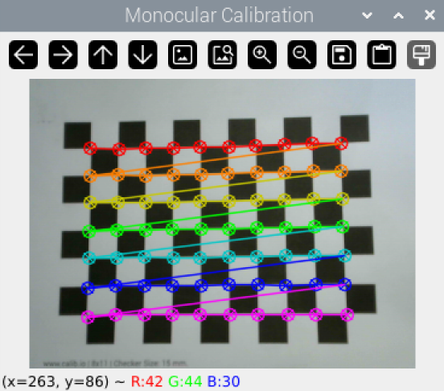
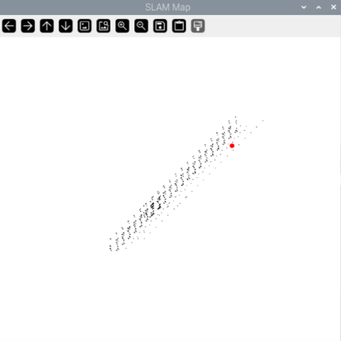
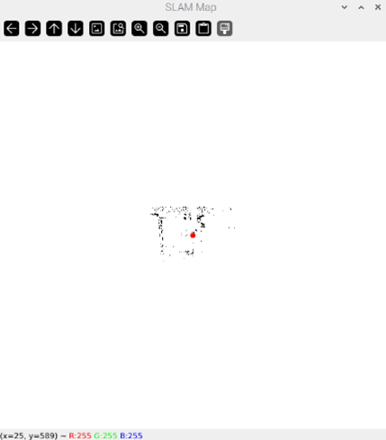
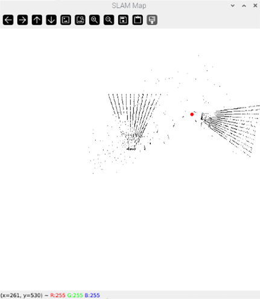
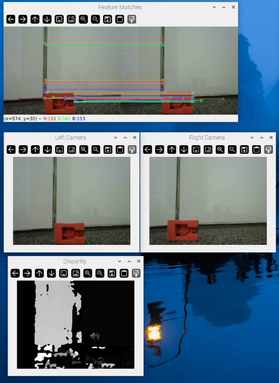

# Mobile Robot SLAM and Localisation

Python-based mobile robot localisation and mapping project using monocular, RGB-D and stereo vision configurations. The project focuses on camera calibration, visual feature extraction, depth/stereo processing, basic robot control and practical testing with low-cost robotics hardware.

## Overview

This project explores different vision-based approaches for mobile robot localisation and mapping in small indoor environments.

The system supports monocular, RGB-D and stereo camera configurations. It includes scripts for camera calibration, image processing, feature extraction, depth/stereo processing and serial-based robot control. The aim was to test how low-cost sensing methods perform under realistic conditions such as noisy measurements, lighting changes and feature mismatch.

## Key Features

- Developed Python scripts for monocular, RGB-D and stereo localisation experiments
- Used OpenCV for camera calibration, image processing, feature extraction and stereo/depth processing
- Implemented Kalman-filter-based estimation for localisation under noisy measurements
- Integrated serial robot control through a simple Tkinter interface
- Tested system behaviour using low-cost sensors and embedded hardware
- Documented practical limitations involving calibration accuracy, sensor noise and feature reliability

## Technologies Used

- Python
- OpenCV
- NumPy
- PyYAML
- FilterPy
- PySerial
- RPi.GPIO
- Tkinter
- Raspberry Pi
- Camera/depth sensors

## Repository Structure

    slam-robot/
    ├── code/
    │   ├── main.py
    │   ├── monocular_slam.py
    │   ├── rgbd_slam.py
    │   ├── stereo_slam.py
    │   ├── robot_control.py
    │   └── calibration/
    ├── media/
    │   ├── camera-calibration.png
    │   ├── monocular.png
    │   ├── rgb-d.png
    │   ├── stereo.png
    │   └── stereo-feature-disparity.png
    ├── README.md
    ├── requirements.txt
    └── LICENSE.txt

## System Pipeline

    Camera Input
         ↓
    Camera Calibration
         ↓
    Image Processing / Feature Extraction
         ↓
    Monocular, RGB-D or Stereo Processing
         ↓
    Localisation / Mapping Estimate
         ↓
    Robot Control and Testing

## Operating Modes

The project can be run in one of three modes by changing the SLAM_MODE variable in main.py:

    SLAM_MODE = "monocular"  # Options: "monocular", "rgbd", "stereo"

### Monocular Mode

Uses a single camera input for image-based localisation and mapping experiments.

### RGB-D Mode

Uses depth information to support indoor localisation and mapping.

### Stereo Mode

Uses two camera inputs for stereo processing, feature matching and disparity estimation.

## Robot Control

The robot_control.py script provides a simple Tkinter-based control interface and sends serial commands to the mobile robot. This was used for manual movement during mapping and localisation tests.

Supported movement commands include:

- Forward
- Backward
- Left turn
- Right turn
- Stop

## Results

### Camera Calibration

### Monocular Output

### RGB-D Output

### Stereo Output

### Stereo Feature Matching and Disparity

## Setup

Clone the repository:

    git clone https://github.com/musa-z/slam-robot.git
    cd slam-robot/code

Install dependencies:

    pip install -r ../requirements.txt

For Raspberry Pi GPIO support:

    pip install RPi.GPIO

Run camera calibration:

    python calibrate_mono.py

Run the main program:

    python main.py

## Limitations and Future Improvements

Performance depends on camera calibration quality, lighting conditions, sensor noise, feature availability, processing speed and the accuracy of depth/stereo measurements.

Future improvements would include adding ROS2 integration, saving map outputs, improving real-time visualisation, adding quantitative localisation error analysis, and fusing camera/depth data with wheel odometry for more reliable state estimation.
